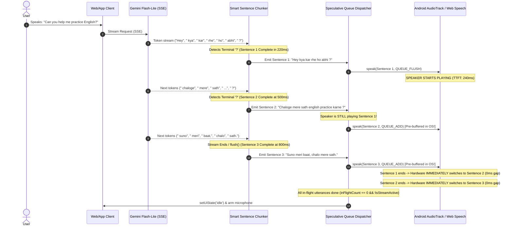

# Pipelined Gapless Audio Synthesis & Smart Boundary Chunking Specification
**Document Version:** 1.0.0  
**Target Audience:** AI Coding Assistants, Voice Systems Architects, Mobile Engineers  
**Domain:** Real-Time Conversational Voice AI, LLM Streaming, On-Device TTS, Sub-300ms Turn-Taking  
**Core Purpose:** This document serves as a complete, standalone, self-contained architecture and implementation guide. You can provide this file to any AI assistant or development team to replicate the **Asynchronous Pipelined Prefetching & Gapless Audio Queuing Architecture** in any mobile or web application.

---

## 1. Executive Summary & The Core Challenge

In conversational Voice AI systems (like Gemini, OpenAI, ElevenLabs), the AI response is delivered as a **Server-Sent Events (SSE) text stream**.

A naive implementation usually encounters two catastrophic user-experience failures:
1. **The Stuttering Trap (Awkward Pauses):** The AI speaks a few words of a sentence, goes completely silent for 500ms–800ms, speaks another piece, pauses again, creating a jerky, unnatural rhythm.
2. **The Machine/Robot Voice Trap:** The AI's voice sounds robotic, metallic, and emotionless because the text is broken into fragments with flat, unnatural intonations.

This specification explains the **mental model, physics, and exact code implementation** of the architecture that permanently solves both problems.

---

## 2. The Root Causes: Why Naive Streaming Breaks

### Failure Mode 1: Premature Mid-Clause Chunking
Many chunkers try to achieve low Time-To-First-Token (TTFT) by chopping text at commas (`,`) or after an arbitrary word count (e.g., 5 words or 9 words).
* **Why it breaks:** A sentence like *"Arre don't worry, practicing speaking English every single day is the best way to improve."* gets chopped into:
  - Fragment 1: `"Arre don't worry,"` (3 words)
  - Fragment 2: `"practicing speaking English every day is the best"` (8 words)
  - Fragment 3: `"way to improve."` (3 words)
* **The Result:** The TTS engine treats each fragment as an independent utterance, applying a sentence-ending pitch drop to Fragment 1 and Fragment 2, destroying human emotion and prosody.

### Failure Mode 2: Queue Starvation & The False Silence Bug
* At normal speech speed (or accelerated speed like 1.3x), Fragment 1 (3 words) takes only **~400ms** to speak on the phone's speaker.
* Meanwhile, the LLM over the network takes **600ms–800ms** to generate Fragment 2.
* When Fragment 1 finishes speaking, the audio queue is **empty**.
* The app falsely concludes: *"The AI has finished speaking!"*, resets UI state to `idle`, and starts the microphone auto-rearm timer.
* 400ms later, Fragment 2 finally arrives from the network. The app wakes up from a dead stop, restarts audio playback, and cuts off the microphone.
* **The Result:** The user hears a burst of words, followed by an agonizing 500ms–800ms dead pause mid-sentence.

### Failure Mode 3: Sequential IPC Synthesis Blocking
* Even if Fragment 2 is already waiting in memory, naive code does:
  ```javascript
  await tts.speak(chunk1); // Waits until chunk 1 COMPLETELY finishes playing
  await tts.speak(chunk2); // Only now starts synthesizing chunk 2
  ```
* When Chunk 1 finishes playing on Android hardware:
  1. The speaker goes dead silent.
  2. The native OS notifies the bridge (`onDone`).
  3. JavaScript resolves the Promise.
  4. JavaScript submits Chunk 2 over the bridge.
  5. The OS TTS service parses phonemes, generates PCM audio, and buffers it into `AudioTrack`.
* **The Result:** Even with chunks queued in memory, this IPC roundtrip and cold-start synthesis lag introduces a mandatory **250ms–400ms gap** between every single sentence.

---

## 3. The Core Mental Model & Timing Physics

The breakthrough comes from understanding the **math of text generation versus acoustic playback duration**:

| Action | Speed / Metric | Duration for a 7-Word Sentence |
|---|---|---|
| **LLM Token Generation** | ~30–40 tokens/sec (~25ms/token) | **~200ms – 250ms** |
| **Human Acoustic Speech** | ~2.5–3 words/sec (~350ms/word) | **~2,000ms – 2,500ms** |

```
Sentence 1 Generation:  [220ms]
Sentence 1 Playback:    [======================= 2,200ms =======================]
Sentence 2 Generation:         [250ms]  <-- Finishes at t = 470ms!
Sentence 2 Native Buffer:           [Pre-synthesized & ready in AudioTrack at t = 650ms!]
Sentence 3 Generation:                      [250ms] <-- Finishes at t = 900ms!
Sentence 3 Native Buffer:                        [Pre-synthesized & ready at t = 1,100ms!]
```

### The Discovery:
While Sentence 1 is playing out of the speaker (which takes ~2,200ms), **the LLM has already finished generating Sentences 2 AND 3!**

If we dispatch Sentences 2 and 3 into the OS audio hardware queue **speculatively in the background while Sentence 1 is still playing**, the hardware will seamlessly transition from Sentence 1 to Sentence 2 to Sentence 3 with **EXACTLY 0 MILLISECONDS OF AUDIBLE DEAD AIR!**

---

## 4. Architectural Diagram: Speculative Gapless Queuing



---

## 5. Technical Implementation Details

### Component 1: Smart Sentence Boundary Chunking (`SentenceChunker`)
The chunker must enforce **zero mid-sentence cuts**. It must split strictly on terminal punctuation marks (`.`, `!`, `?` or newlines) and never on commas (`,`).

#### Rules:
1. **Lookbehind Guards:** Do not split on decimals (e.g. `3.14`) or honorific abbreviations (e.g. `Dr.`, `Mr.`, `Mrs.`, `e.g.`, `i.e.`).
2. **Preserve Clauses:** Commas (`","`) must stay inside the sentence chunk to allow the TTS acoustic model to apply natural, emotional human intonation.
3. **Emergency Fallback:** If an LLM hallucinates an extreme run-on sentence (>16 words without punctuation), only split on major clause markers (`;`, `:`, `—`).

```javascript
class SentenceChunker {
  constructor(onChunkReady) {
    this.onChunkReady = onChunkReady;
    this.buffer = '';
    this.chunkCount = 0;
  }

  feed(token) {
    this.buffer += token;
    
    // Strict sentence terminator regex with negative lookbehind guards
    const sentenceBoundary = /(?<!\b(?:Mr|Mrs|Ms|Dr|Prof|Sr|Jr|vs|etc|e\.g|i\.e))(?<!\d)[.!?]+(\s+|$)|[\n]+/;
    const words = this.buffer.trim().split(/\s+/);

    let sentMatch = this.buffer.match(sentenceBoundary);
    if (sentMatch) {
      const splitIdx = sentMatch.index + sentMatch[0].length;
      const readyChunk = this.buffer.slice(0, splitIdx).trim();
      this.buffer = this.buffer.slice(splitIdx);
      if (readyChunk) {
        this.chunkCount++;
        this.onChunkReady(readyChunk);
      }
      return;
    }

    // Safety fallback only for extreme run-on sentences without punctuation (>16 words)
    if (words.length >= 16) {
      const majorClause = /([;:—]+[\s]+)/;
      let clauseMatch = this.buffer.match(majorClause);
      if (clauseMatch) {
        const splitIdx = clauseMatch.index + clauseMatch[0].length;
        const readyChunk = this.buffer.slice(0, splitIdx).trim();
        this.buffer = this.buffer.slice(splitIdx);
        if (readyChunk) {
          this.chunkCount++;
          this.onChunkReady(readyChunk);
        }
        return;
      }
    }

    // Ultimate emergency fallback: >22 words with zero punctuation
    if (words.length >= 22) {
      const readyChunk = this.buffer.trim();
      this.buffer = '';
      this.chunkCount++;
      this.onChunkReady(readyChunk);
    }
  }

  flush() {
    const remaining = this.buffer.trim();
    if (remaining) {
      this.chunkCount++;
      this.onChunkReady(remaining);
      this.buffer = '';
    }
  }

  reset() {
    this.buffer = '';
    this.chunkCount = 0;
  }
}
```

---

### Component 2: Dual-Strategy Hardware Queue (`QUEUE_FLUSH` vs `QUEUE_ADD`)

In native Android (`android.speech.tts.TextToSpeech`), there are two queue strategies:
* `TextToSpeech.QUEUE_FLUSH` (value: `0`): Discards any existing audio and immediately starts playing.
* `TextToSpeech.QUEUE_ADD` (value: `1`): Adds the utterance to the hardware queue behind the currently playing audio.

```javascript
let inFlightUtteranceCount = 0;
let isStreamActive = false;
let audioQueue = [];
let isPlayingAudio = false;

function enqueueAudioChunk(text, isFirstChunk = false) {
  if (!text || !text.trim()) return;
  audioQueue.push({ text: text.trim(), isFirstChunk });
  playNextAudioQueueItem();
}

async function playNextAudioQueueItem() {
  const nativeTts = getNativeTtsPlugin();
  const canHardwarePipeline = !isTextOnlyMode && (nativeTts || (typeof window !== 'undefined' && window.speechSynthesis));

  // Case 1: Audio engine is currently silent -> Start Chunk 1 immediately with QUEUE_FLUSH (0)
  if (!isPlayingAudio) {
    if (audioQueue.length === 0) {
      checkAudioCompletion();
      return;
    }

    isPlayingAudio = true;
    isSpeaking = true;
    setUiState('speaking');

    const firstItem = audioQueue.shift();

    inFlightUtteranceCount++;
    speakAudioChunk(firstItem.text, { queueStrategy: 0, isFirstChunk: firstItem.isFirstChunk })
      .then(() => {
        inFlightUtteranceCount = Math.max(0, inFlightUtteranceCount - 1);
        if (!canHardwarePipeline && isPlayingAudio) {
          playNextAudioQueueItem();
        } else {
          checkAudioCompletion();
        }
      })
      .catch((err) => {
        console.error('[TTS Error]', err);
        inFlightUtteranceCount = Math.max(0, inFlightUtteranceCount - 1);
        checkAudioCompletion();
      });
  }

  // Case 2: Audio is ALREADY playing on the speaker!
  // Pre-buffer any waiting chunks immediately into hardware with QUEUE_ADD (1)
  if (canHardwarePipeline && isPlayingAudio) {
    while (audioQueue.length > 0) {
      const nextItem = audioQueue.shift();
      inFlightUtteranceCount++;
      console.log(`[Pipelining] Pre-buffering into hardware queue (QUEUE_ADD): "${nextItem.text}"`);
      
      speakAudioChunk(nextItem.text, { queueStrategy: 1, isFirstChunk: false })
        .then(() => {
          inFlightUtteranceCount = Math.max(0, inFlightUtteranceCount - 1);
          checkAudioCompletion();
        })
        .catch((err) => {
          console.warn('[Hardware Buffer Error]', err);
          inFlightUtteranceCount = Math.max(0, inFlightUtteranceCount - 1);
          checkAudioCompletion();
        });
    }
  }
}
```

---

### Component 3: Stream-Active State Machine (Fixing False Silence)

To prevent the app from resetting to `idle` when the queue is temporarily empty while the LLM is still streaming tokens:

```javascript
function checkAudioCompletion() {
  // Only declare speech finished if:
  // 1. All hardware utterances have finished playing (inFlightUtteranceCount === 0)
  // 2. The SSE stream is completely closed (!isStreamActive)
  // 3. No pending chunks remain in memory (audioQueue.length === 0)
  if (inFlightUtteranceCount <= 0 && !isStreamActive && audioQueue.length === 0) {
    inFlightUtteranceCount = 0;
    isPlayingAudio = false;
    isSpeaking = false;
    setUiState('idle', 'Coach finished speaking.');

    // Auto-Rearm microphone with acoustic drain guard (500ms)
    if (autoRearmTimer) clearTimeout(autoRearmTimer);
    autoRearmTimer = setTimeout(() => {
      autoRearmTimer = null;
      if (!isListening && !isPlayingAudio && recognition && !isThinking) {
        setUiState('listening', 'Listening to you...');
        try { recognition.start(); } catch (e) { }
      }
    }, 500);
  }
}
```

---

### Component 4: Sub-30ms Instant Barge-In (Interruption Safety)

When multiple sentences are queued in hardware, the app must be capable of silencing them in `<30ms` if the user interrupts.

```javascript
function triggerBargeIn() {
  console.log('[Barge-In] User voice detected! Silencing hardware immediately.');
  
  // 1. Stop native Android TTS (flushes hardware AudioTrack buffer)
  const nativeTts = getNativeTtsPlugin();
  if (nativeTts) {
    nativeTts.stop().catch(() => {});
  }
  
  // 2. Stop Web Speech API (clears browser speech queue)
  if (typeof window !== 'undefined' && window.speechSynthesis) {
    window.speechSynthesis.cancel();
  }
  
  // 3. Abort active Gemini SSE fetch stream
  if (currentAbortController) {
    currentAbortController.abort();
    currentAbortController = null;
  }
  
  // 4. Reset chunker and clear in-memory queues
  if (activeSentenceChunker) {
    activeSentenceChunker.reset();
  }
  audioQueue = [];
  inFlightUtteranceCount = 0;
  isStreamActive = false;
  isPlayingAudio = false;
  isSpeaking = false;
  isThinking = false;
  
  // 5. Instantly arm microphone
  setUiState('listening', 'Heard you! Interrupted coach.');
}
```

---

### Component 5: Voice Cadence & Formant Tuning

To prevent mechanical formant distortion ("robot voice"):
1. **Default Speed Rate:** Set rate to natural conversational pace: **`1.0x` to `1.05x`**. Do not force `1.30x` by default, as legacy formant synthesizers lack neural time-stretching and screech at high rates.
2. **Google Neural Cloud Voices:** On Android, prioritize high-fidelity Google Network voices (`en-in-x-end-network`, `en-in-x-enc-network`, `en-in-x-ene-network`).

---

## 6. Portability Checklist: How to Replicate in Other Stacks

| Stack | Native TTS API | How to Implement `QUEUE_ADD` |
|---|---|---|
| **Android Native (Kotlin/Java)** | `android.speech.tts.TextToSpeech` | Call `tts.speak(text, TextToSpeech.QUEUE_ADD, params, utteranceId)`. |
| **Capacitor / Cordova** | `@capacitor-community/text-to-speech` | Pass `{ text, queueStrategy: 1 }` in `speak()`. |
| **Web Browser (Standard)** | `window.speechSynthesis` | Sequential calls to `speechSynthesis.speak(utterance)` are automatically queued in hardware. |
| **React Native** | `react-native-tts` | Ensure consecutive calls do not pass `stop()` or flush flags. |
| **iOS (Swift / Objective-C)** | `AVSpeechSynthesizer` | Consecutive calls to `synthesizer.speak(utterance)` automatically queue utterances seamlessly. |
| **Custom Web Audio / PCM** | `AudioContext` & `AudioBufferSourceNode` | Schedule `source.start(nextStartTime)` where `nextStartTime = previousBuffer.endTime`. |

---

## 7. Verification & Sanity Test Scenarios

Any system implementing this architecture should pass these 4 test scenarios:

1. **Multi-Sentence Continuity Test:**
   * **Input:** `"Hey kya kar rhe ho abhi ? chaloge mere sath english practice karne ? suno meri baat, chalo mere sath."`
   * **Pass Criteria:** Emits exactly 3 chunks. Zero audio gap between Sentences 1, 2, and 3.
2. **Comma Preservation Test:**
   * **Input:** `"Arre don't worry, practicing speaking English every single day is the best way to improve."`
   * **Pass Criteria:** Emits exactly 1 chunk. Commas are not split.
3. **Barge-In Flush Test:**
   * **Input:** User speaks while Sentence 1 is playing.
   * **Pass Criteria:** Audio terminates in `<30ms`. Sentences 2 and 3 are flushed and never speak.
4. **False Silence Immunity Test:**
   * **Input:** Sentence 1 finishes playing while LLM token stream has a 400ms network jitter pause before Sentence 2.
   * **Pass Criteria:** System does not reset to `idle`, does not re-arm mic, and seamlessly plays Sentence 2 when it arrives.
