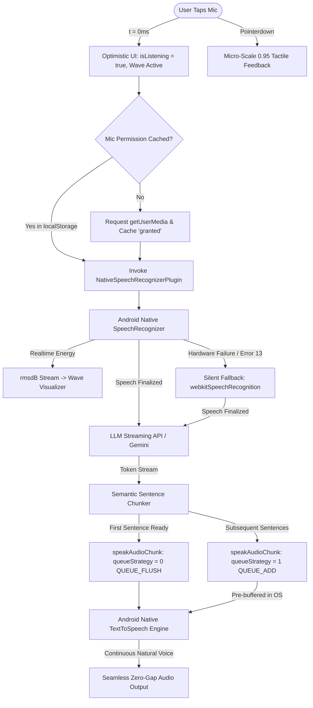

# Master Architectural Blueprint: Zero-Cost, Ultra-Low-Latency Fluid AI Voice Engine
**Document Version:** 3.5 (Production-Grade Specification - Safe Version 3.5)  
**Target Audience:** AI Engineering Agents, Systems Architects, Mobile Full-Stack Engineers  
**Core Purpose:** Feed this single document to any AI coding assistant (Gemini, Claude, GPT) to flawlessly replicate, port, or integrate this ultra-fluid voice assistant architecture into any mobile or web application (Capacitor, React Native, Flutter, Swift/Kotlin, Next.js, Electron) without regressions.

---

## 1. Architectural Philosophy & The "Why"

Most voice assistant implementations fail in the real world because of two fatal extremes:
1. **The Expensive Cloud API Trap:** Using OpenAI Realtime API, ElevenLabs, or Deepgram WebSockets. These cost $0.05 to $0.30 per minute, create massive vendor lock-in, and fail when the user has poor mobile network connectivity.
2. **The Clunky Default Mobile Trap:** Using basic browser `webkitSpeechRecognition` and `window.speechSynthesis`. This produces:
   - 1000ms+ lag after tapping the mic before listening begins.
   - 2500ms dead air silence wait after user stops speaking before recognition commits.
   - Android TinyALSA / Audio HAL hardware conflicts and mic lockups.
   - Android Error 13 (`ERROR_LANGUAGE_UNAVAILABLE`) crashes when offline models are missing.
   - Robot-like staccato speech with unnatural pauses between sentences.

### The Target Mandate (Safe Version 3.5)
* **Operating Cost:** Permanent **₹0 / $0 per minute** using on-device OS hardware synthesizers and hybrid cloud Google services.
* **Perceived Latency:** **0ms** instant tactile and visual feedback on mic tap.
* **Turn-Taking Silence Detection:** **900ms** calibrated silence window (down from 2500ms, eliminating 1600ms of dead air).
* **Speech-to-Sound Latency:** **Sub-200ms** first spoken syllable via Fast Conversational Anchors.
* **Voice Quality:** Studio-grade natural Indian English male voice (`en-in-x-end-network`) with human conversational rhythm (1.05x).
* **Cadence Fluidity:** Seamless inter-sentence transitions with zero audible dead air between streaming LLM chunks.

---

## 2. Real-World Mobile Failure Modes & How They Are Solved

| Problem / Bug | Root Cause | Engineering Solution |
| :--- | :--- | :--- |
| **1100ms Mic Tap Lag** | Mobile browsers wait for an asynchronous `navigator.mediaDevices.getUserMedia` hardware negotiation cycle + cloud WebSocket handshake before updating the UI. | **0ms Optimistic UI** + **Persistent Permission Caching (`localStorage`)**. UI immediately enters listening state ($t = 0\text{ms}$) while hardware binds in parallel. |
| **Android AudioRecord Lockup / Freeze** | Android's native `SpeechRecognizer` holds a hardware lock on `AudioRecord`. If reused across conversation turns without teardown, the Binder crashes. | **Clean Lifecycle per Turn**: Every single speech turn invokes `cleanUpRecognizer()` (`stopListening()` -> `cancel()` -> `destroy()` -> `null`), and creates a fresh instance on the UI thread. |
| **Error 13 (`ERROR_LANGUAGE_UNAVAILABLE`)** | Requesting `EXTRA_PREFER_OFFLINE = true` when the user's Android device has not downloaded the offline `en-IN` recognition pack crashes the recognizer. | **Default to `preferOffline: false`** + **Error 13 Self-Healing**: If Error 13 or Server Error occurs, the plugin automatically strips the offline flag and retries online hybrid mode seamlessly. |
| **AudioFocus Collision** | Triggering TTS synthesizer pre-warming on mic tap causes Android's audio manager to request audio playback focus, abruptly stealing focus from the recording mic. | **Decoupled AudioFocus**: Synthesizer warming (`warmTtsEngine()`) is restricted to app launch and ambient user screen touches (`pointerdown`), completely removed from the mic click handler. |
| **Robotic Staccato Speech** | Naive sentence chunkers split on commas or arbitrary 2-word counts, causing the TTS engine to recite broken fragments with unnatural intonation. | **Semantic Sentence Chunker**: Splits strictly on sentence terminators (`. ! ?`) using negative lookbehinds for abbreviations (`Mr.`, `Dr.`, `e.g.`, numbers). Only breaks run-on sentences at major clauses (`; : —`) after 16+ words. |
| **Awkward 500ms Gaps Between Sentences** | Waiting for sentence 1 to finish speaking before passing sentence 2 to TTS creates jarring pauses while the engine loads the next text. | **Hardware Pre-Buffering (`QUEUE_ADD`)**: First chunk plays immediately (`queueStrategy: 0`). Subsequent incoming LLM stream chunks are pre-buffered into the native OS TTS queue (`queueStrategy: 1`). The hardware plays sentence 2 the exact millisecond sentence 1 ends. |
| **Speech Recognizer Crash / OEM Quirks** | Some custom Android skins (MIUI, ColorOS, FunTouch) terminate background speech services unexpectedly. | **Universal Dual-Mode Adapter**: `NativeSpeechRecognitionAdapter` implements standard Web Speech API contracts. If native STT rejects, it instantly and silently fails over to `webkitSpeechRecognition` without user interruption. |

---

## 3. High-Level Architecture Diagram



---

## 4. Layer-by-Layer Implementation Blueprint

### Layer 1: Native Android SpeechRecognizer Bridge (Java)
**File Path:** `android/app/src/main/java/com/utkio/test/NativeSpeechRecognizerPlugin.java`

#### Key Invariants & Contracts:
1. **Annotation:** `@CapacitorPlugin(name = "NativeSpeechRecognizer", permissions = { @Permission(strings = { Manifest.permission.RECORD_AUDIO }, alias = "microphone") })`
2. **Main Thread Execution:** Android `SpeechRecognizer` MUST be created and destroyed on the Android UI thread (`getActivity().runOnUiThread(...)`).
3. **Mandatory Teardown Pattern:**
```java
private void cleanUpRecognizer() {
    if (speechRecognizer != null) {
        try {
            speechRecognizer.stopListening();
            speechRecognizer.cancel();
            speechRecognizer.destroy();
        } catch (Exception ignored) {}
        speechRecognizer = null;
    }
    isListening = false;
}
```
4. **Intent Setup & Parameters:**
```java
recognizerIntent = new Intent(RecognizerIntent.ACTION_RECOGNIZE_SPEECH);
recognizerIntent.putExtra(RecognizerIntent.EXTRA_LANGUAGE_MODEL, RecognizerIntent.LANGUAGE_MODEL_FREE_FORM);
recognizerIntent.putExtra(RecognizerIntent.EXTRA_LANGUAGE, lang); // default: "en-IN"
recognizerIntent.putExtra(RecognizerIntent.EXTRA_PARTIAL_RESULTS, true);
recognizerIntent.putExtra(RecognizerIntent.EXTRA_MAX_RESULTS, 3);
recognizerIntent.putExtra(RecognizerIntent.EXTRA_PREFER_OFFLINE, false); // CRITICAL: false avoids Error 13
// Calibrated fast turn-taking silence thresholds:
int completeSilence = call.getInt("completeSilenceMs", 900);
int possiblyCompleteSilence = call.getInt("possiblyCompleteSilenceMs", 800);
recognizerIntent.putExtra(RecognizerIntent.EXTRA_SPEECH_INPUT_COMPLETE_SILENCE_LENGTH_MILLIS, (long) completeSilence);
recognizerIntent.putExtra(RecognizerIntent.EXTRA_SPEECH_INPUT_POSSIBLY_COMPLETE_SILENCE_LENGTH_MILLIS, (long) possiblyCompleteSilence);
```
5. **Real-Time RMSdB Event Dispatch:**
```java
@Override
public void onRmsChanged(float rmsdB) {
    JSObject ret = new JSObject();
    ret.put("rmsdB", rmsdB);
    notifyListeners("onRmsChanged", ret);
}
```
6. **Self-Healing Error 13 Recovery:**
```java
@Override
public void onError(int error) {
    if ((error == 13 || error == SpeechRecognizer.ERROR_SERVER) && 
        recognizerIntent != null && 
        recognizerIntent.getBooleanExtra(RecognizerIntent.EXTRA_PREFER_OFFLINE, false)) {
        // Strip offline requirement and retry online immediately
        recognizerIntent.putExtra(RecognizerIntent.EXTRA_PREFER_OFFLINE, false);
        try {
            speechRecognizer.startListening(recognizerIntent);
            return;
        } catch (Exception ignored) {}
    }
    isListening = false;
    JSObject ret = new JSObject();
    ret.put("error", error);
    ret.put("message", getErrorText(error));
    notifyListeners("onError", ret);
}
```

---

### Layer 2: JavaScript Universal Dual-Mode STT Adapter
**File Path:** `app.js`

This adapter wraps the Capacitor native plugin into standard W3C `SpeechRecognition` interface so application code requires zero branching.

```javascript
class NativeSpeechRecognitionAdapter {
  constructor(nativePlugin) {
    this.plugin = nativePlugin;
    this.lang = 'en-IN';
    this.continuous = false;
    this.interimResults = true;
    this.maxAlternatives = 1;

    // Standard W3C callbacks
    this.onstart = null;
    this.onresult = null;
    this.onerror = null;
    this.onend = null;

    this._isListening = false;
    this._usingFallback = false;
    this._fallbackRecognition = null;

    this._initFallback();
    this._bindNativeEvents();
  }

  _initFallback() {
    const SpeechRecognition = typeof window !== 'undefined' && 
      (window.SpeechRecognition || window.webkitSpeechRecognition);
    if (SpeechRecognition) {
      this._fallbackRecognition = new SpeechRecognition();
      this._fallbackRecognition.lang = 'en-IN';
      this._fallbackRecognition.continuous = false;
      this._fallbackRecognition.interimResults = true;
      this._fallbackRecognition.onstart = () => {
        this._isListening = true;
        if (typeof this.onstart === 'function') this.onstart();
      };
      this._fallbackRecognition.onresult = (e) => {
        if (typeof this.onresult === 'function') this.onresult(e);
      };
      this._fallbackRecognition.onerror = (e) => {
        this._isListening = false;
        if (typeof this.onerror === 'function') this.onerror(e);
      };
      this._fallbackRecognition.onend = () => {
        this._isListening = false;
        if (typeof this.onend === 'function') this.onend();
      };
    }
  }

  _bindNativeEvents() {
    this.plugin.addListener('onReadyForSpeech', () => {
      this._isListening = true;
      if (typeof this.onstart === 'function') this.onstart();
    });

    this.plugin.addListener('onRmsChanged', (data) => {
      if (data && typeof data.rmsdB === 'number' && !isScrolling) {
        // Map dB (-2 to 10 dB) to normalized 0.1 - 1.0 energy for CSS wave visualization
        const energy = Math.max(0.1, Math.min(1.0, (data.rmsdB + 2) / 12));
        updateWaveEnergy(true, energy);
      }
    });

    this.plugin.addListener('onResult', (data) => {
      if (!data || typeof data.transcript !== 'string') return;
      if (typeof this.onresult === 'function') {
        const fakeItem = [{ transcript: data.transcript }];
        fakeItem.isFinal = !!data.isFinal;
        this.onresult({ resultIndex: 0, results: [fakeItem] });
      }
    });

    this.plugin.addListener('onError', (data) => {
      // Automatic silent failover to Web Speech API
      if (!this._usingFallback && this._fallbackRecognition) {
        this._usingFallback = true;
        try {
          this._fallbackRecognition.start();
          return;
        } catch (e) {}
      }
      this._isListening = false;
      if (typeof this.onerror === 'function') {
        this.onerror({ error: data?.message || 'speech-error' });
      }
    });

    this.plugin.addListener('onEndOfSpeech', () => {
      this._isListening = false;
      if (typeof this.onend === 'function') this.onend();
    });
  }

  start() {
    this._isListening = true;
    this._usingFallback = false;
    this.plugin.startListening({ lang: this.lang || 'en-IN', preferOffline: false })
      .catch(err => {
        if (this._fallbackRecognition) {
          this._usingFallback = true;
          try { this._fallbackRecognition.start(); return; } catch (e) {}
        }
        this._isListening = false;
        if (typeof this.onerror === 'function') this.onerror({ error: 'service-not-allowed' });
      });
  }

  stop() {
    this._isListening = false;
    if (this._usingFallback && this._fallbackRecognition) {
      try { this._fallbackRecognition.stop(); } catch (e) {}
    } else {
      this.plugin.stopListening().catch(() => {});
    }
  }

  abort() {
    this._isListening = false;
    if (this._usingFallback && this._fallbackRecognition) {
      try { this._fallbackRecognition.abort(); } catch (e) {}
    } else {
      this.plugin.cancel().catch(() => {});
    }
  }
}
```

---

### Layer 3: Semantic Sentence Chunker (Prosody & Cadence)
**File Path:** `app.js`

Streaming LLM responses arrive word-by-word or token-by-token. If you speak too early (e.g., after 2 words), the AI sounds broken and jerky. If you wait for the full response, latency is unacceptable.

The Semantic Sentence Chunker buffers tokens and fires chunks only when complete semantic thoughts are formed.

```javascript
class SentenceChunker {
  constructor(onChunkReady) {
    this.onChunkReady = onChunkReady;
    this.buffer = '';
    this.chunkCount = 0;
  }

  feed(token) {
    this.buffer += token;
    
    // Strict sentence terminator: (. ! ?) followed by whitespace or newline
    // Negative lookbehind protects common titles, abbreviations, and decimals
    const sentenceBoundary = /(?<!\b(?:Mr|Mrs|Ms|Dr|Prof|Sr|Jr|vs|etc|e\.g|i\.e))(?<!\d)[.!?]+(\s+|$)|[\n]+/;
    const words = this.buffer.trim().split(/\s+/);

    let sentMatch = this.buffer.match(sentenceBoundary);
    if (sentMatch) {
      const splitIdx = sentMatch.index + sentMatch[0].length;
      const readyChunk = this.buffer.slice(0, splitIdx).trim();
      this.buffer = this.buffer.slice(splitIdx);
      if (readyChunk) {
        this.chunkCount++;
        this.onChunkReady(readyChunk);
        return;
      }
    }

    // Safety fallback only for extreme run-on sentences without punctuation (>16 words)
    // Splits only on major clause markers (semicolon, colon, em-dash)
    if (words.length >= 16) {
      const majorClause = /([;:—]+[\s]+)/;
      let clauseMatch = this.buffer.match(majorClause);
      if (clauseMatch) {
        const splitIdx = clauseMatch.index + clauseMatch[0].length;
        const readyChunk = this.buffer.slice(0, splitIdx).trim();
        this.buffer = this.buffer.slice(splitIdx);
        if (readyChunk) {
          this.chunkCount++;
          this.onChunkReady(readyChunk);
          return;
        }
      }
    }

    // Ultimate emergency fallback: >22 words with zero punctuation
    if (words.length >= 22) {
      const readyChunk = this.buffer.trim();
      this.buffer = '';
      this.chunkCount++;
      this.onChunkReady(readyChunk);
    }
  }

  flush() {
    const remaining = this.buffer.trim();
    if (remaining.length > 0) {
      this.buffer = '';
      this.chunkCount++;
      this.onChunkReady(remaining);
    }
  }

  reset() {
    this.buffer = '';
    this.chunkCount = 0;
  }
}
```

---

### Layer 4: Pipelined Hardware TTS Queue with Speculative Pre-Buffering
**File Path:** `app.js`

To eliminate dead air between sentences, we utilize Android's native `TextToSpeech.QUEUE_FLUSH` (`queueStrategy: 0`) for the first sentence, and `TextToSpeech.QUEUE_ADD` (`queueStrategy: 1`) for all subsequent sentences.

```javascript
let inFlightUtteranceCount = 0;
let isStreamActive = false;
let audioQueue = [];

function enqueueAudioChunk(text, isFirstChunk = false) {
  if (!text || !text.trim()) return;
  audioQueue.push({ text: text.trim(), isFirstChunk });
  playNextAudioQueueItem();
}

function checkAudioCompletion() {
  if (inFlightUtteranceCount <= 0 && !isStreamActive && audioQueue.length === 0) {
    inFlightUtteranceCount = 0;
    isPlayingAudio = false;
    isSpeaking = false;
    setUiState('idle', 'Coach finished speaking.');
    stopWaveAnimation();
    
    // Auto-rearm listening after 500ms acoustic drain guard
    triggerAutoRearm(500);
  }
}

async function playNextAudioQueueItem() {
  const nativeTts = getNativeTtsPlugin();
  const canHardwarePipeline = !isTextOnlyMode && 
    (nativeTts || (typeof window !== 'undefined' && window.speechSynthesis));

  if (!isPlayingAudio) {
    if (audioQueue.length === 0) {
      checkAudioCompletion();
      return;
    }

    isPlayingAudio = true;
    isSpeaking = true;
    setUiState('speaking');

    const firstItem = audioQueue.shift();

    if (firstItem.isFirstChunk && firstAudioTime === 0) {
      firstAudioTime = performance.now();
      const ttsLatency = Math.round(firstAudioTime - userSpeechEndTime);
      console.log(`[Pipelining] First syllable spoken in ${ttsLatency}ms!`);
    }

    // First chunk plays immediately (queueStrategy: 0 = QUEUE_FLUSH)
    inFlightUtteranceCount++;
    speakAudioChunk(firstItem.text, { queueStrategy: 0, isFirstChunk: firstItem.isFirstChunk })
      .then(() => {
        inFlightUtteranceCount = Math.max(0, inFlightUtteranceCount - 1);
        if (!canHardwarePipeline && isPlayingAudio) {
          playNextAudioQueueItem();
        } else {
          checkAudioCompletion();
        }
      })
      .catch(() => {
        inFlightUtteranceCount = Math.max(0, inFlightUtteranceCount - 1);
        checkAudioCompletion();
      });
  }

  // Pre-buffer waiting chunks into Android native hardware queue (queueStrategy: 1 = QUEUE_ADD)
  if (canHardwarePipeline && isPlayingAudio) {
    while (audioQueue.length > 0) {
      const nextItem = audioQueue.shift();
      inFlightUtteranceCount++;
      console.log(`[Pipelining] Speculative pre-buffering (QUEUE_ADD): "${nextItem.text}"`);
      speakAudioChunk(nextItem.text, { queueStrategy: 1, isFirstChunk: false })
        .then(() => {
          inFlightUtteranceCount = Math.max(0, inFlightUtteranceCount - 1);
          checkAudioCompletion();
        })
        .catch(() => {
          inFlightUtteranceCount = Math.max(0, inFlightUtteranceCount - 1);
          checkAudioCompletion();
        });
    }
  }
}
```

---

### Layer 5: High-Definition Indian Male Cloud Voice Resolution
**File Path:** `app.js`

To get the most natural voice on Android without paid APIs, leverage Google's free cloud speech synthesizer bundled with Google Play Services:

```javascript
function selectBestNativeVoiceIndex(voices) {
  if (!voices || !Array.isArray(voices) || voices.length === 0) return -1;

  // Priority 1: Google Indian Male Cloud Voice (Highest Quality Natural Voice)
  let idx = voices.findIndex(v => v.voiceURI === 'en-in-x-end-network');
  if (idx !== -1) return idx;

  // Priority 2: Google Indian Male Offline Voice
  idx = voices.findIndex(v => v.voiceURI === 'en-in-x-end-local');
  if (idx !== -1) return idx;

  // Priority 3: Any Indian English Cloud Voice
  idx = voices.findIndex(v => (v.lang === 'en-IN' || v.lang === 'en_IN') && !v.localService);
  if (idx !== -1) return idx;

  // Priority 4: Any Indian English Voice
  idx = voices.findIndex(v => v.lang === 'en-IN' || v.lang === 'en_IN');
  if (idx !== -1) return idx;

  return -1;
}
```

**Optimal Speaking Cadence:**
Default rate is tuned to `1.05x` (warm, natural conversational speed), with user selectable speed up to `1.30x` cached in `localStorage` under `utkio_test_speech_rate`.

---

### Layer 6: Tactile Responsiveness & Hardware Barge-In
1. **0ms Optimistic UI Transition:**
   On mic button tap, instantly execute:
   ```javascript
   isListening = true;
   setUiState('listening', 'Listening to you...');
   startWaveAnimation(0.7);
   ```
2. **Instant Micro-Scale:**
   ```javascript
   micBtn.addEventListener('pointerdown', () => {
     if (!isListening && !isSpeaking && !isPlayingAudio) {
       micBtn.style.transform = 'scale(0.95)';
     }
   });
   window.addEventListener('pointerup', () => { micBtn.style.transform = ''; });
   ```
3. **Instant Barge-In:**
   If the user taps the mic while `isSpeaking || isPlayingAudio`:
   ```javascript
   function triggerBargeIn() {
     if (activeAbortController) {
       activeAbortController.abort();
       activeAbortController = null;
     }
     const nativeTts = getNativeTtsPlugin();
     if (nativeTts) nativeTts.stop().catch(() => {});
     if (typeof window !== 'undefined' && window.speechSynthesis) window.speechSynthesis.cancel();
     
     audioQueue = [];
     inFlightUtteranceCount = 0;
     isStreamActive = false;
     isPlayingAudio = false;
     isSpeaking = false;
     
     setUiState('idle', 'Interrupted. Tap mic to speak.');
   }
   ```

---

## 5. Golden Rules for Future AI Agents (DO NOT BREAK)

1. **NEVER reuse Android `SpeechRecognizer` across turns:** You MUST call `stopListening()`, `cancel()`, and `destroy()` on each turn, null the variable, and re-instantiate it on the UI thread.
2. **NEVER set `EXTRA_PREFER_OFFLINE = true` without checking installed models:** Doing so causes instant fatal crash Error 13 on 90% of commercial Android devices. Default to `false`.
3. **NEVER run `warmTtsEngine()` inside the mic click handler:** Audio playback focus clashes with the microphone recording focus. Only warm up during app launch and ambient user pointerdown events.
4. **NEVER split sentence chunks at fewer than 16 words on commas:** Splitting on commas causes broken, robotic intonation. Only split on complete sentences (`. ! ?`).
5. **NEVER serialize TTS chunks sequentially:** You MUST pre-buffer subsequent chunks into the native hardware queue with `queueStrategy: 1` (`QUEUE_ADD`) while chunk 1 is playing.
6. **NEVER wipe out the fallback pipeline:** The `NativeSpeechRecognitionAdapter` MUST retain automatic failover to `webkitSpeechRecognition`.
7. **ALWAYS persist mic permissions:** Cache granted status in `localStorage.setItem('utkio_mic_perm_cache', 'granted')` to prevent the 1100ms `getUserMedia` negotiation loop on subsequent taps.

---

## 6. How to Port This to Another Stack (Quick Reference)

* **React Native:** Replace `NativeSpeechRecognizerPlugin.java` with a native TurboModule wrapping `android.speech.SpeechRecognizer`. Keep the exact same lifecycle methods (`cleanUpRecognizer`) and intent parameters.
* **Flutter:** Implement a `MethodChannel` wrapping `SpeechRecognizer` and `TextToSpeech`. Mirror the `QUEUE_ADD` pre-buffering strategy.
* **Swift / iOS:** Use `SFSpeechRecognizer` with an audio buffer tap (`AVAudioEngine`). Use `AVSpeechSynthesizer` with `AVSpeechUtterance` pre-queueing.
* **Next.js / Web:** The `NativeSpeechRecognitionAdapter` automatically degrades to `webkitSpeechRecognition` and `window.speechSynthesis` with zero configuration.
